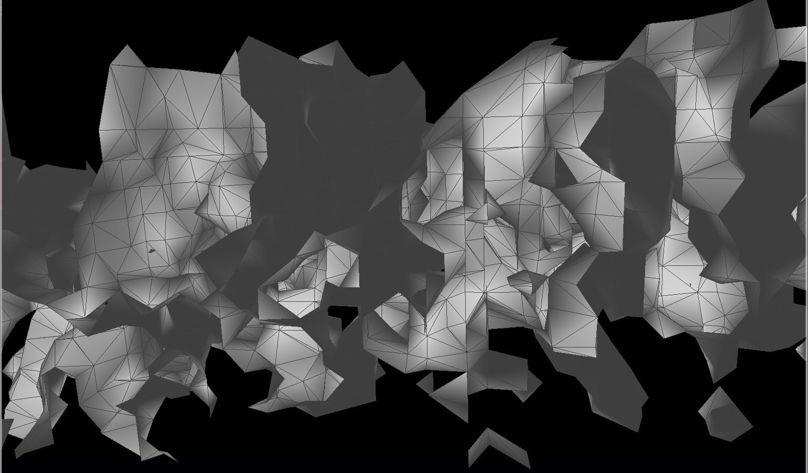
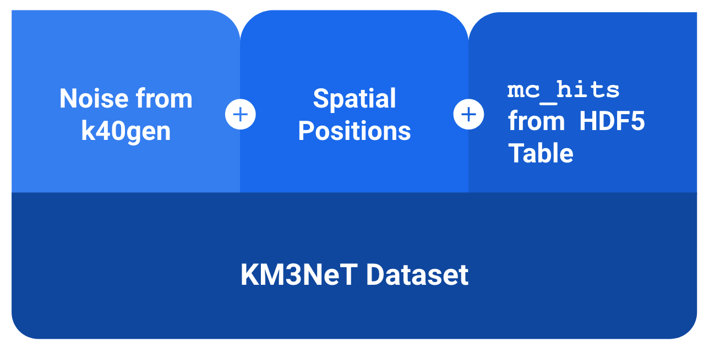
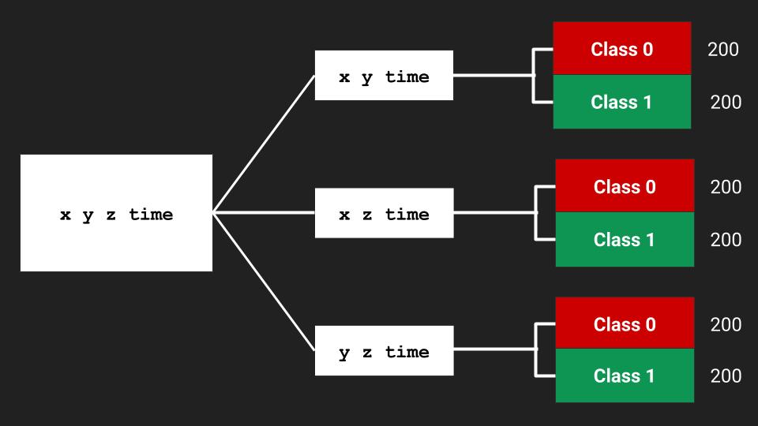
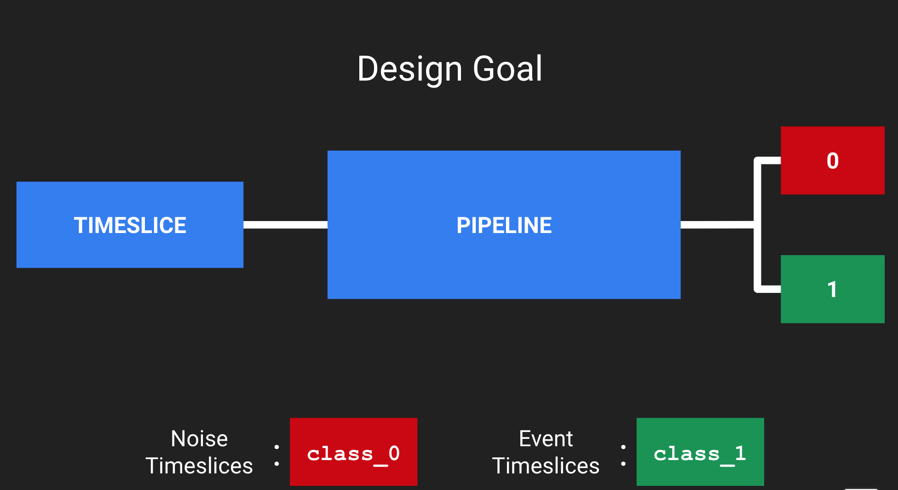
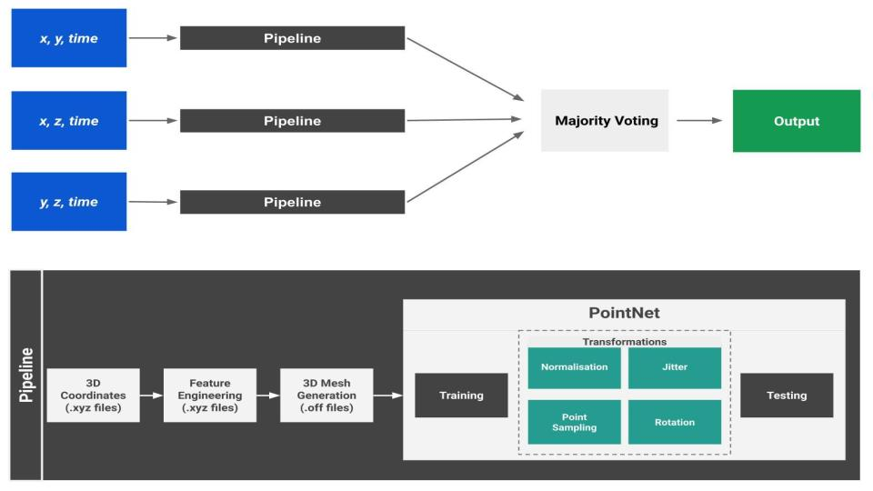
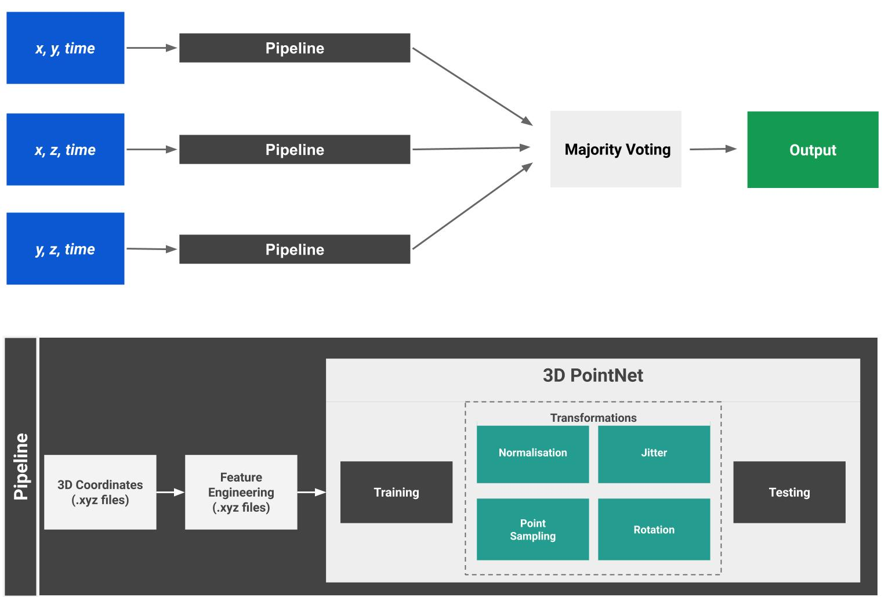
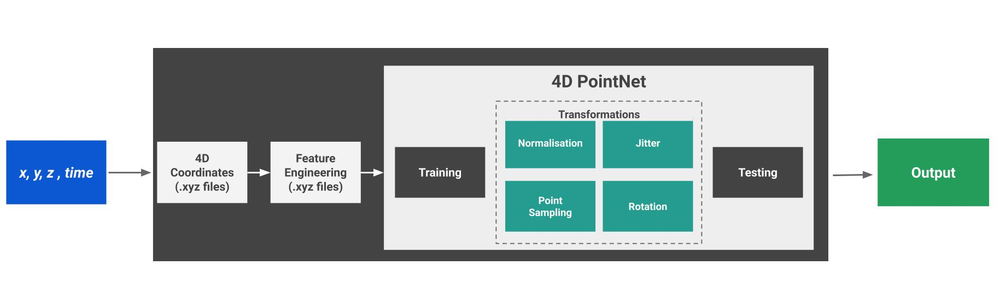

# Masters Thesis: KM3NeT Neutrino Detection Using PointNet 

This research was performed as part of the Masters Thesis, in collaboration with Vrije Universiteit and Universiteit van Amsterdam, The Netherlands eScience Center 
and Nikhef. 



Particle physics involves examination of sub-atomic particles and their interactions. The main challenge in this field often lies in the separation
of background noise from event signals. Most neural networks in the field use CNNs for particle classification. But this often leads to loss of 
information when converting data to images. This thesis examines the application of PointNet - a 3D classification network for KM3NeT neutrino data. 

The thesis has a two-fold interest.

First, it wishes to investigate the role of 3D deep learning in neutrino identification. 
Next, it wishes to apply the network on KM3NeT data to save neutrino information while discarding background noise. 

In order to assess the feasibility of PointNet, three research questions were formulated:

***RQ1.0** Can PointNet, a geometric neural network architecture be trained to identify timeslices that contain neutrino event hits from
timeslices that contain only background noise?* 
***RQ1.1** Can PointNet achieve a Recall score of greater than 0.9 for identifying timeslices with event hits?*

***RQ2.0** Can the KM3NeT dataset be effectively represented using 3D meshes?*
***RQ2.1** Which meshing algorithm would be most suitable for representing the data?*

***RQ3.0** Can PointNet be extended to obtain energy properties from neutrino events?*

The dataset was prepared by combining three sources



A label of 0 or 1 was added to each hit to indicate if it was noise or from an event. The complete dataset was also temporally binned into
15000 nanoseconds to form timeslices.

The data comprising of `x y z time`is split into three datasets - `x y time`, `x z time` and `y z time`. The three datasets are passed
through the pre-processing pipeline and trained individually. 

 

A pipeline was formulated. The design goal was such that given an input timeslice, the pipeline would output a `0` or `1`
to indicate if the timeslice should be discarded or saved respectively.



Within the pre-processing pipeline:
1. 3D coordinates are obtained from each dataset to form point clouds
2. Feature engineering using Radius Based Outlier Detection is performed on the point clouds to reduce noise
3. Point clouds are converted to 3D meshes using Surface Poisson Reconstrauction

Within the PointNet architecture:
1. Fixed points are sampled per input point cloud
2. All point clouds are transformed & normalised
3. Random noise is added and point clouds are rotated randomly around the z-axis



Two majority voting ensemble techniques are used to combine predictions from the three models: hard and soft voting
The network showed promising results with a **95% recall** for the positive class and **perfect precision**. 
The model also demonstrated **perfect recall for the noise class**.

3D and 4D pointnet models were also tested





PointNet was deemed unsuitable for energy inference. Instead non-linear regression techniques in the form of decision trees and random
forest boosting were tested. 


Being the first known work of its kind, results  from the thesis indicate PointNet to be a viable methodology for future neutrino research.

# How to Use this Repo (Under Construction)

```
|-assets/       # all images
|-colab-notebooks # contains all notebooks with PointNet models to be run in Google Colab environment
|-notebooks # contains all notebooks for pre-processing pipeline
|-source # contains modular code for PointNet architecture [WIP]
|-experiment-records # detailed experiment log
|-report # contains presentation slides and official Latex report
```

The easiest way to run the PointNet models are using Google Colab. The official report is under `report\thesis.pdf`.

1. All pre-processing efforts are under `notebooks`
2. All PointNet models can be quickly run on Google Colab. These are under `colab-notebooks`
3. Once trained, models can be evaluated. Code for this is also under `colab-notebooks\evaluate_PointNet.ipynb`

Refactor PointNet [TODO]

# Cite

Please do not forget to cite this work if you use it in your own research!

```bibtex
@MastersThesis{srao2020km3net,
  author =       {Shruti Rao},
  title =        {KM3NeT Neutrino Detection using PointNet},
  school =       {Vrije Universiteit and Universiteit van Amsterdam},
  year =         {2020}
}
```

